## Setting up wp-browser with Local by Flywheel to test a plugin

**Note**: the original version of this guide used, on Mac, the version of Local by Flywheel based on VirtualBox and Docker containers. That version has been replaced by a new one that will not use any virtualization layer. The UI is almost the same but, for back-compatibility purposes, I've not removed the references to the previous version; I have, instead, pointed out where the set up values and procedures might differ due to the changes.

## Requirements

* A Mac or Windows machine
* A working installation of [Local By Flywheel][0967-0003].
* You should be able to create sites and visit them from your browser without issues.
* [Composer](https://getcomposer.org/) installed and working on your terminal `PATH`, you should be able to run `composer --version` at the terminal and see the version correctly.

## Install Local by Flywheel

This walk-through starts after [Local by Flywheel][0967-0003] has been installed and is correctly running on your machine; you can [download Local from the site][0967-0003] and follow the installation instructions.  

In the context of this guide I'm assuming the sites directory is `~/Local Sites`, the default "Sites Path" in Local preferences.

If your document root lies elsewhere, replace the `~/Local Sites` path with the actual directory in each command.  


## Creating the databases and installing WordPress

Using Local UI create a new site:

* The site name is `myplugin`.
* The site administrator user name is `admin`.
* The site administrator password is `password`.

Once Local provisioned and installed the new site, open the "Database" administration tab and, depending on your OS, start a database administration UI or website.
In the image below I'm using Adminer:

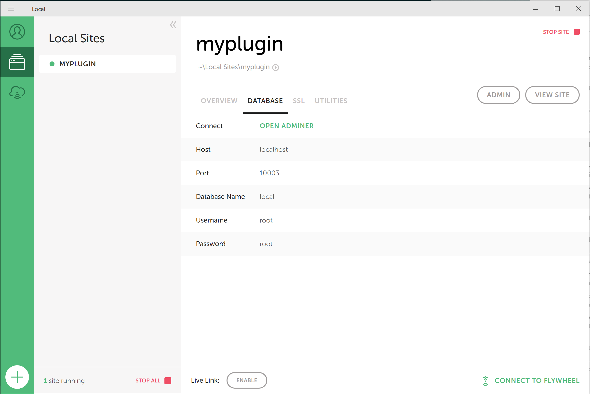

Create a database called `tests`:

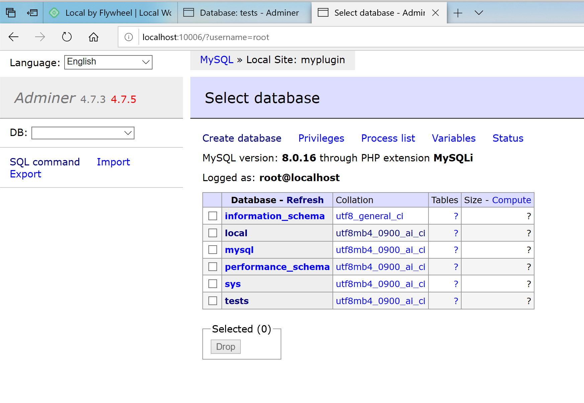

Make sure you can visit the WordPress installation at `http://myplugin.local` and that you can correctly access the administration area at `http://myplugin.local/wp-admin`.

## Scaffolding the project folder

I'm assuming the scope of the development is to test the `my-plugin` plugin.  

The first step is to create the bare minimum code required to make the plugin show up among the available WordPress plugins.  
Create the main plugin file in the WordPress installation plugins directory, in the `~/Local Sites/myplugin/app/public/wp-content/plugins/my-plugin/my-plugin.php` file:

```php
<?php
/**
 * Plugin Name: My plugin
 */	
```

The plugin should now show up, activate and deactivate correctly, among the plugins listed in the WordPress installation at `http://myplugin.local/wp-admin/plugins.php`.  

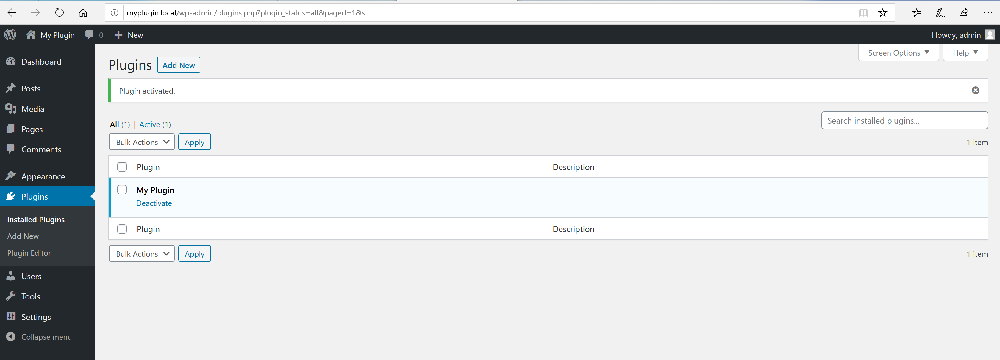

## Installing wp-browser

Open a terminal window and navigate to the plugin directory and initialize the Composer project:

```bash
cd ~/Local Sites/myplugin/app/public/wp-content/plugins/my-plugin
composer init
```

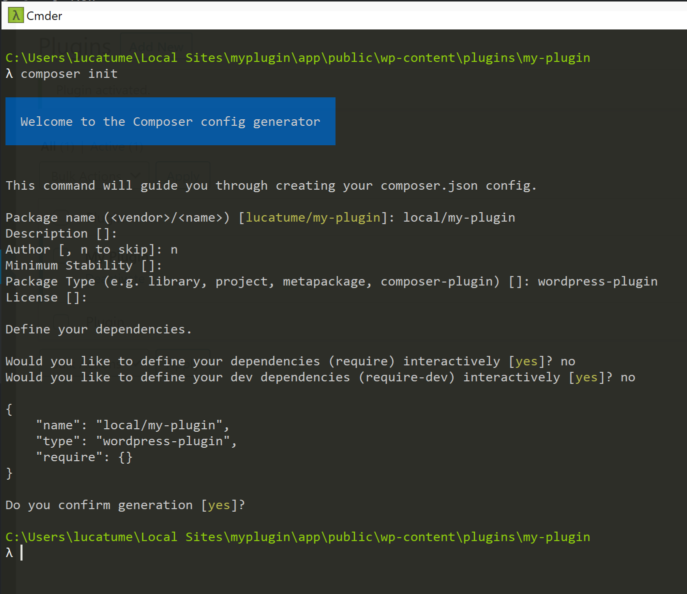

Composer will ask some questions to initialize the project, for the sake of this small guide the answers are not relevant.
Here is the `composer.json` file generated by the above answers:

```json
{
    "name": "local/my-plugin",
    "type": "wordpress-plugin",
    "require": {}
}
```

Next require `lucatume/wp-browser` as a development dependency:

```bash
composer require --dev lucatume/wp-browser
```

Composer installs any dependency binary file, an executable file, in the project `vendor/bin` folder.   
To check [Codeception](http://codeception.com/ "Codeception - BDD-style PHP testing.") is correctly installed run this command:

```bash
vendor/bin/codecept --version
```


> Since wp-browser requires Codeception, there is no need to require Codeception explicitly as a development dependency.

## Setting up wp-browser

For those that might get lost while trying to set up [wp-browser](https://github.com/lucatume/wp-browser "lucatume/wp-browser · GitHub") for the first time the VVV context provides an excellent base to understand the process.  

wp-browser needs to know:

* Where the WordPress installation files are located: they will be loaded in integration and "WordPress unit" tests.
* How to connect to the WordPress site "normal" database: this is the database that stores the data of the site I would see when visiting the local installation URL at `http://myplugin.local`.
* How to connect to the database dedicated to the integration and "WordPress unit" tests: this database will be used to install WordPress during integration and "WordPress unit" tests.

Any test suite using a database **should never run on a database containing data of any value**; this means that your first step should be to **backup the site database**.  

You can create a backup of the current site database contents using whatever tool the version of Local you're using provides.  
In this example I'm using Adminer:

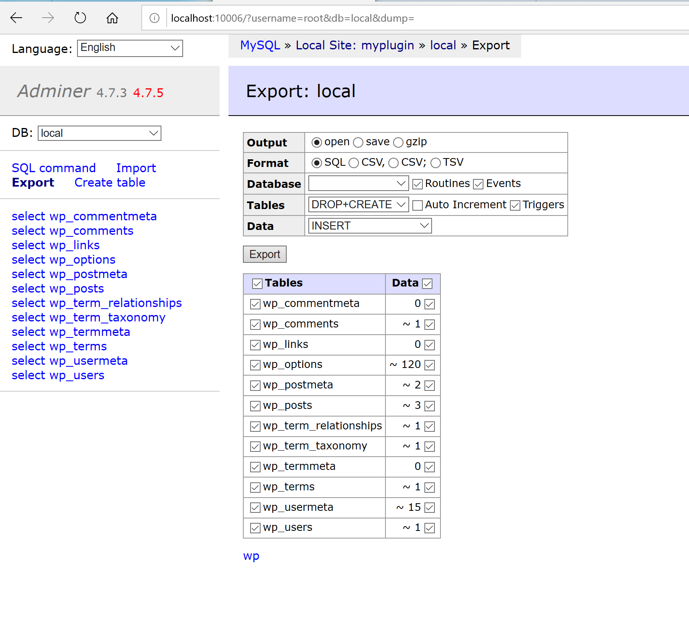

At any moment you can re-import the site database dump using, again, phpMyAdmin, under the "Import" tab:

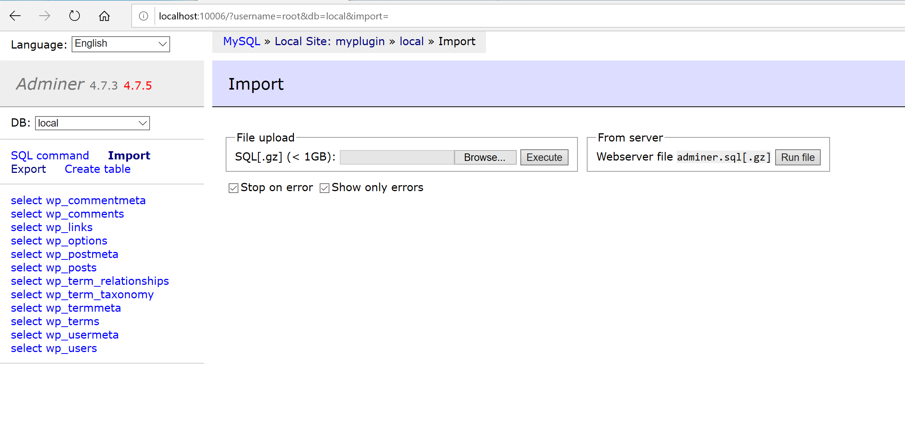

## Bootstrapping and configuring wp-browser

After the backup is done it's time to bootstrap `wp-browser` using its interactive mode:

```bash
cd ~/Local Sites/myplugin/app/public/wp-content/plugins/my-plugin
vendor/bin/codecept init wpbrowser
```

The initialization guide will ask a number of questions.  

### Windows configuration

In the screenshots below are the answers I used to configure `wp-browser` on Windows.

Note that I've set up the database host using the values provided by Local UI, yours might differ depending on the version of Local you're using:

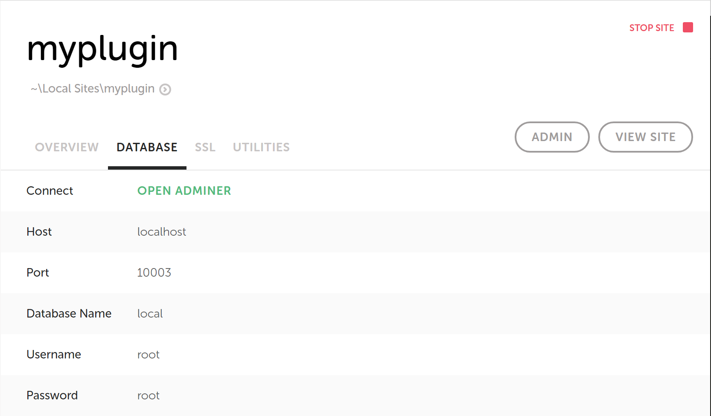

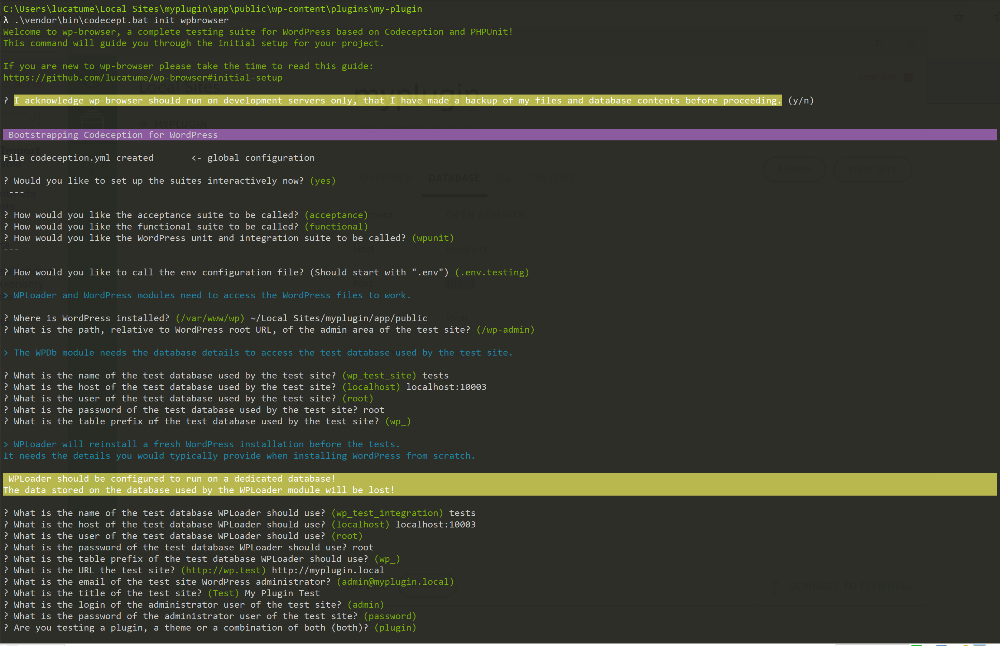

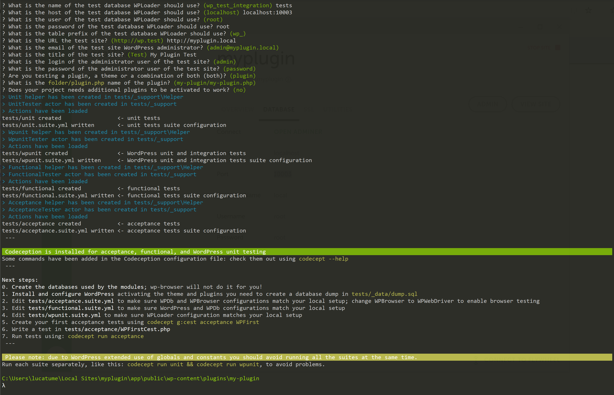

Below a complete list of each answer:

* I acknowledge wp-browser should run on development servers... `y`
* Would you like to set up the suites interactively now? `y`
* How would you like the acceptance suite to be called? `acceptance`
* How would you like the functional suite to be called? `functional`
* How would you like the WordPress unit and integration suite to be called? `wpunit`
* How would you like to call the env configuration file? `.env.testing`
* What is the path of the WordPress root directory? `~/Local Sites/myplugin/app/public`
* What is the path, relative to WordPress root URL, of the admin area of the test site? `/wp-admin`
* What is the name of the test database used by the test site? `tests`
* What is the host of the test database used by the test site? `localhost:10003`
* What is the user of the test database used by the test site? `root`
* What is the password of the test database used by the test site? `root`
* What is the table prefix of the test database used by the test site? `wp_`
* What is the name of the test database WPLoader should use? `tests`
* What is the host of the test database WPLoader should use? `localhost:10003`
* What is the user of the test database WPLoader should use? `root`
* What is the password of the test database WPLoader should use? `root`
* What is the table prefix of the test database WPLoader should use? `wp_`
* What is the URL the test site? `http://myplugin.local`
* What is the email of the test site WordPress administrator? `admin@myplugin.local`
* What is the title of the test site? `My Plugin Test`
* What is the login of the administrator user of the test site? `admin`
* What is the password of the administrator user of the test site? `password`
* Are you testing a plugin, a theme or a combination of both (both)? `plugin`
* What is the folder/plugin.php name of the plugin? `my-plugin/my-plugin.php`
* Does your project needs additional plugins to be activated to work? `no`

Codeception will build the suites for the first time and should be ready to go.

### Mac configuration

In the screenshots below are the answers I used to configure `wp-browser` on Mac.

Note that I've set up the database host using the values provided by Local UI, yours might differ.

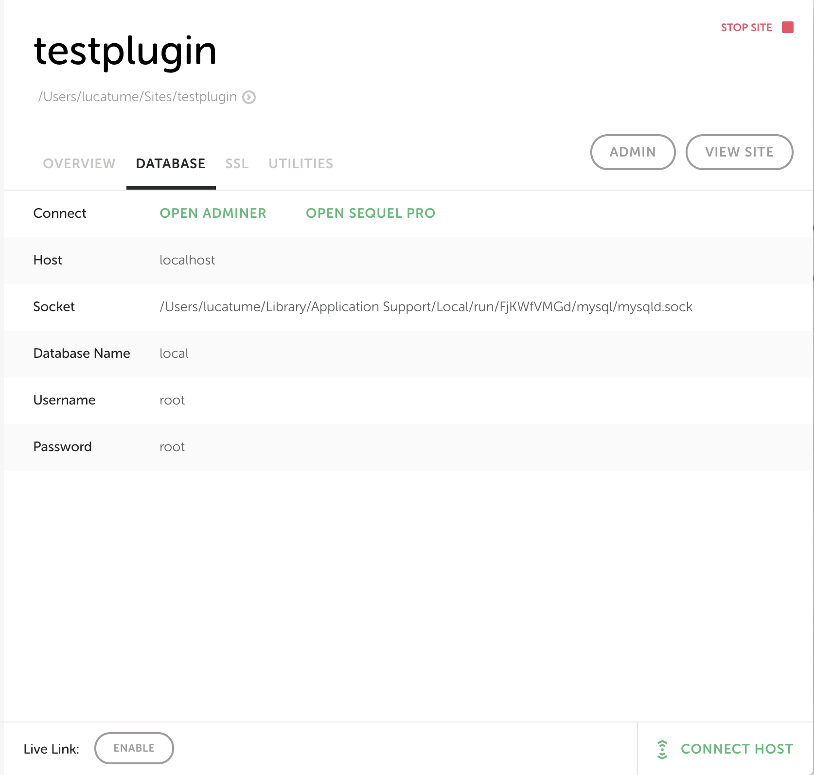

This screenshot is from the previous version of Local, the one based on VirtualBox and Docker:


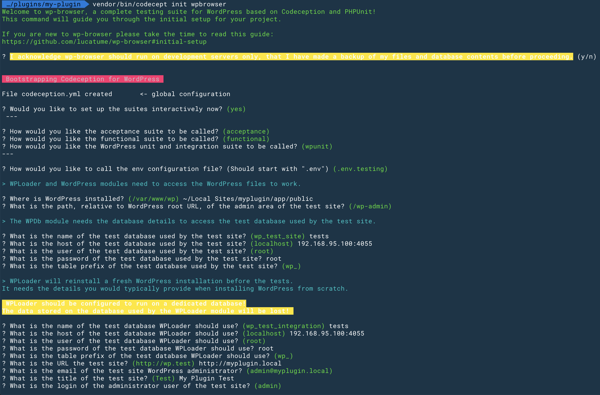

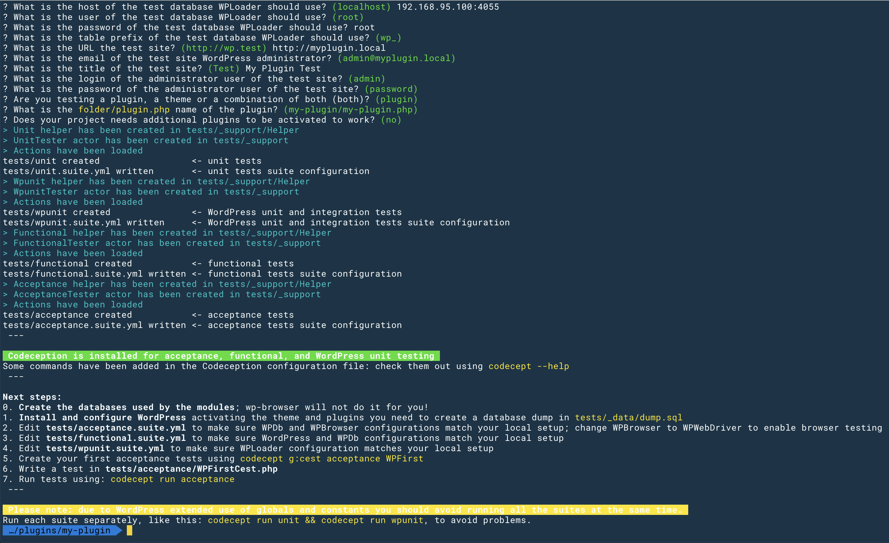

Below a complete list of each answer:

* I acknowledge wp-browser should run on development servers... `y`
* Would you like to set up the suites interactively now? `y`
* How would you like the acceptance suite to be called? `acceptance`
* How would you like the functional suite to be called? `functional`
* How would you like the WordPress unit and integration suite to be called? `wpunit`
* How would you like to call the env configuration file? `.env.testing`
* What is the path of the WordPress root directory? `~/Local Sites/myplugin/app/public`
* What is the path, relative to WordPress root URL, of the admin area of the test site? `/wp-admin`
* What is the name of the test database used by the test site? `tests`
* What is the host of the test database used by the test site? `/Users/lucatume/Library/Application Support/Local/run/FjKWfVMGd/mysql/mysqld.sock` ( or `192.168.95.100:4055` on an older version of Local)
* What is the user of the test database used by the test site? `root`
* What is the password of the test database used by the test site? `root`
* What is the table prefix of the test database used by the test site? `wp_`
* What is the name of the test database WPLoader should use? `tests`
* What is the host of the test database WPLoader should use? `/Users/lucatume/Library/Application Support/Local/run/FjKWfVMGd/mysql/mysqld.sock` (or `192.168.95.100:4055` on an older version of Local)
* What is the user of the test database WPLoader should use? `root`
* What is the password of the test database WPLoader should use? `root`
* What is the table prefix of the test database WPLoader should use? `wp_`
* What is the URL the test site? `http://myplugin.local`
* What is the email of the test site WordPress administrator? `admin@myplugin.local`
* What is the title of the test site? `My Plugin Test`
* What is the login of the administrator user of the test site? `admin`
* What is the password of the administrator user of the test site? `password`
* Are you testing a plugin, a theme or a combination of both (both)? `plugin`
* What is the folder/plugin.php name of the plugin? `my-plugin/my-plugin.php`
* Does your project needs additional plugins to be activated to work? `no`

Codeception will build the suites for the first time and should be ready to go.

## Setting up the starting database fixture

A "fixture", in testing terms, is a minimal, starting environment shared by all tests.  
In [BDD](https://en.wikipedia.org/wiki/Behavior-driven_development) it's the `Background` any scenario will share.
In the case of a plugin the minimal, starting environment is the following:

* A fresh WordPress installation empty of any content.
* WordPress using its default theme.
* The only active plugin is the one you're testing, in this example: `my-plugin`.

You should set up this fixture "manually", using the site administration UI at `http://myplugin.local/wp-admin`.

> The following command will **empty the site, backup any content you care about first!**

When you're done setting up the initial database fixture, export it using the "Export" tab of your database tool of choice, and move the file to the `~/Local Sites/myplugin/app/public/wp-content/plugins/my-plugin/tests/_data/dump.sql` directory.

There is one last step left to complete the setup.

## Using the tests database in acceptance and functional tests

Acceptance and functional tests will act as users, navigating to the site pages and making requests as a user would.  

This means that WordPress will load, and with it its `wp-config.php` file, to handle the requests made by the tests.  

During the setup phase I've specified the database to be used for `acceptance` and `functional` tests as `tests` but, looking at the contents of the `~/Local Sites/myplugin/app/public/wp-config.php` file, the `DB_NAME` constant is set to `local`.  

What we'll do now means:

* If the request is a normal one, use the `local` database.
* If the request comes from a test, use the `tests` database.

In your IDE/text-editor of choice edit the `~/Local Sites/myplugin/app/public/wp-config.php` and replace the line defining the `DB_NAME` constant like this:

```diff
- define( 'DB_NAME', 'local' );
+ if( isset( $_SERVER['HTTP_X_WPBROWSER_REQUEST'] ) && $_SERVER['HTTP_X_WPBROWSER_REQUEST'] ) { 
+    define( 'DB_NAME', 'tests' );
+ } else {
+    define( 'DB_NAME', 'local' );
+ }
```

Here's the copy-and-paste friendly version:

```php
if( isset( $_SERVER['HTTP_X_TEST_REQUEST'] ) && $_SERVER['HTTP_X_TEST_REQUEST'] ) {
		define( 'DB_NAME', 'tests' );
} else {
		define( 'DB_NAME', 'local' );
}
```

If you look at the `tests/acceptance.suite.yml` and `tests/functional.suite.yml` files, respectively the `acceptance` and `functional` suite configuration files, you will see these entries in the `WPBrowser` module configuration:

```yaml
headers:
    X_TEST_REQUEST: 1
    X_WPBROWSER_REQUEST: 1
```

This means that, with each HTTP request done during tests, the module will send the two headers.  
Those headers are read, on the WordPress side, using the `$_SERVER['HTTP_X_TEST_REQUEST']` and `$_SERVER['X_WPBROWSER_REQUEST']` variables.

[Codeception](http://codeception.com/ "Codeception - BDD-style PHP testing.") and [wp-browser](https://github.com/lucatume/wp-browser "lucatume/wp-browser · GitHub") are ready to run and the test-drive development can start.

## Sanity check

Before starting to write tests, take a moment to run each suite separately and make sure all is set up correctly.  

If you run into issues, there's a chance you forgot something along the way, please take the time to read this tutorial a second time before opening an issue.

You have created 4 suites, each suite has at least one example test to make sure all works.  
Run each suite and make sure all tests succeed, from within the box run:

```bash
cd ~/Local Sites/myplugin/app/public/wp-content/plugins/my-plugin 
vendor/bin/codecept run acceptance
vendor/bin/codecept run functional
vendor/bin/codecept run wpunit
vendor/bin/codecept run unit
```
 
You're now run to customize the suites to your liking or start writing tests, run `vendor/bin/codecept` to see a list of the available commands.

[0967-0003]: https://localwp.com/
