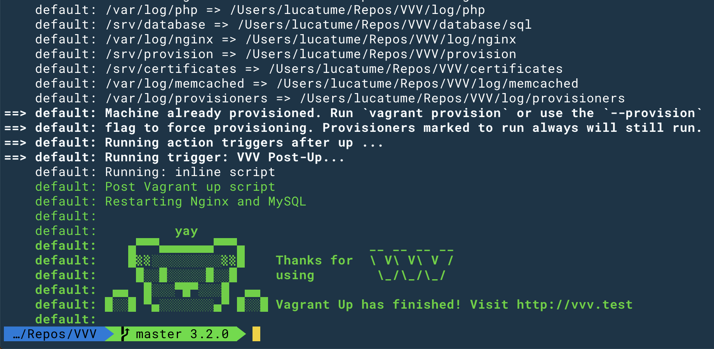
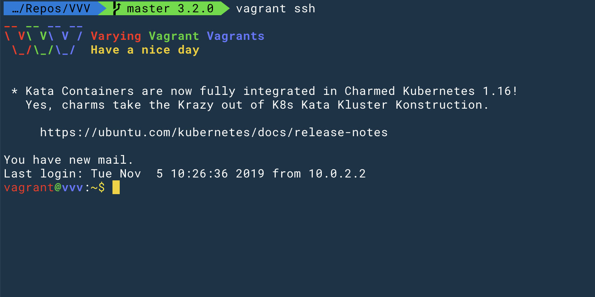
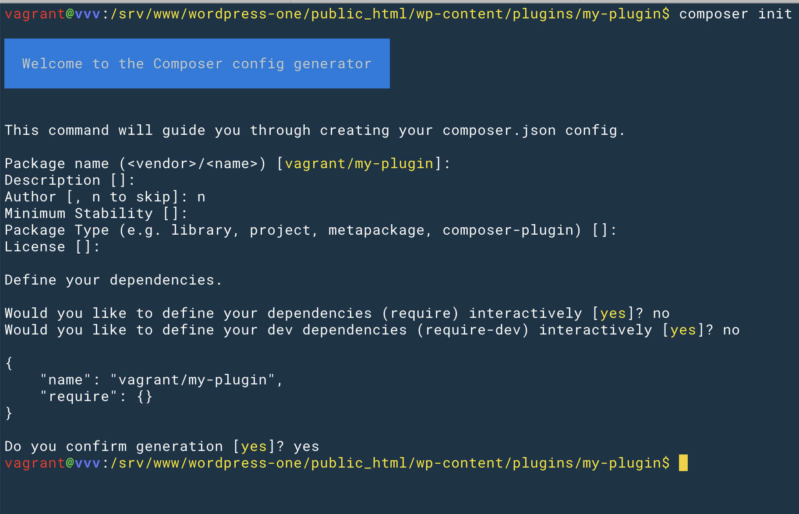
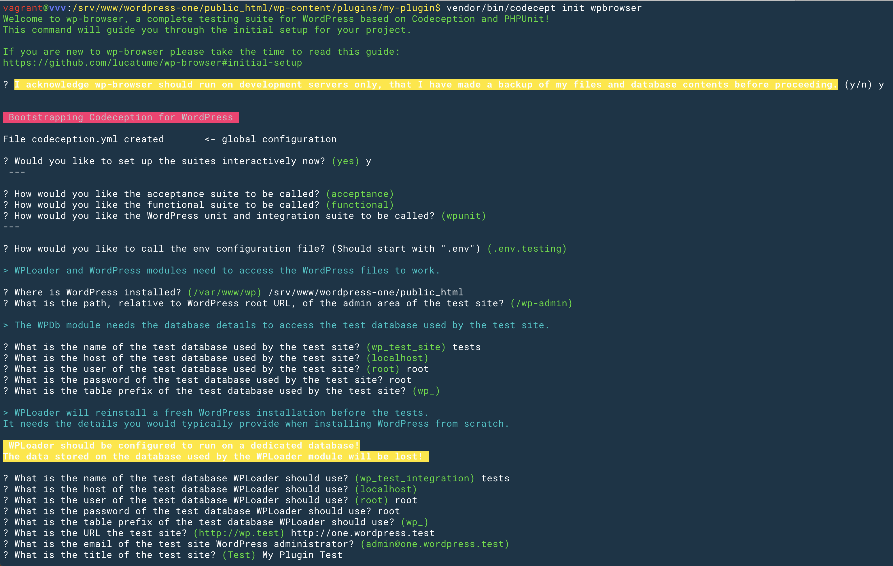
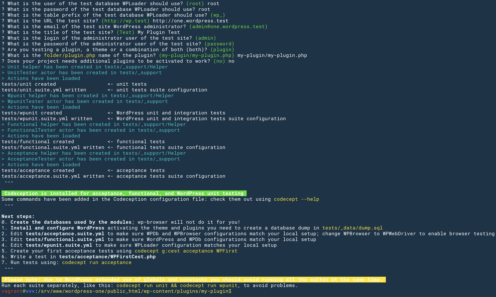

## Setting up wp-browser on VVV to test a plugin

## Requirements

* A Windows, Linux or Mach machine (I'll call this the "host machine" or just "host").
* A working installation of [VVV](!g vvv wordpress); you should be able to navigate to VVV root directory, run the `vagrant up` command, and have VVV up and running.
* On the VVV installation you should be able to visit the two default sites URLs without issues; the two default sites addresses are:
	* http://one.wordpress.test
	* http://two.wordpress.test

## Why VVV?

The [VVV project](https://varyingvagrantvagrants.org/) provides a "a Vagrant configuration for developing with WordPress" and is an excellent, no-frills, starting point to develop WordPress projects (themes, plugins and whole sites.  
Based on [Vagrant](!g) and [Virtual Box](!g), VVV removes the differences between systems by providing a uniform, Ubuntu Linux based, virtual machine that will bahave the same on Windows, Linux and Mac.
Configuring it to run WordPress tests is easy: let's get started.  

## Check VVV works correctly

This walk-through starts after VVV has been installed and is running on the host machine; the [installation guide is clear and simple to follow](https://varyingvagrantvagrants.org/docs/en-US/installation/) and I'm not duplicating it here.  
In the context of this guide I'm assuming VVV lives in the `~/Repos/VVV` folder, that we are working on the `my-plugin` project and that the plugin is being developed in the default (`wordpress-one`) WordPress installation provided by the box.  
If your VVV installation lies elsewhere, replace the `~/Repos/VVV` with the actual directory in each command.  

After completing the installation of VVV navigate to VVV root folder and run the `vagrant up` command:

```bash
cd ~/Repos/VVV
vagrant up
```



After the automatic bootstrap and initialization process completed, VVV makes two WordPress sites available:

* `http://one.wordpress.test/` is the first default site address.
* `http://two.wordpress.test/` is the second default site address.
* `http://vvv.test/` is VVV dashboard address.

You should be able to reach each one of the URLs above without issues, should this not be the case something during VVV setup did not go according to the plan and you should fix it before moving on.  

If the sanity check above is complete it's time to move to the following part specific to [Codeception](http://codeception.com/ "Codeception - BDD-style PHP testing.") and [wp-browser](https://github.com/lucatume/wp-browser "lucatume/wp-browser · GitHub") setup.  

## In and out, host and guest

The Vagrant box provided by VVV goes beyond a simple MySQL, PHP and Ngnix server stack and provides a complete WordPress development environment; tools like [Composer](https://getcomposer.org/), [grunt-cli][4992-0003], and [wp-cli][4992-0006] are ready to use.  

This allows the entire development, when it comes to the CLI tools, to happen **in the virtual machine and not outside of it**.  

"Inside the virtual machine" means the first CLI instruction to run from the `~/Repos/VVV` folder (assuming that is the folder where VVV was installed) is this:

```bash
cd ~/Repos/VVV
vagrant ssh
```



This will connect, via SSH, to the virtual machine as the `vagrant` user.  
To exit from the SSH session inside the box, just type `exit` and return.

**Note**: any further instruction I'm showing here, beside the code editing that will happen in a dedicated PHP IDE like [PHPStorm][4992-0004] or [Sublime Text][4992-0005] on the host machine, will happen "inside the virtual machine".  

When I say "host machine" I mean your laptop, desktop or whatever computer you're working on; when I say "guest machine" I mean VVV virtual machine; this is usually the case for any virtual-ish setup (Vagrant, Docker and the like).  

## Scaffolding the project folder

I'm assuming the scope of the development is to create the `my-plugin` plugin.  

The first step is to create the bare minimum code required to make the plugin show up among the available WordPress plugins.  
Create the main plugin file in the `http://one.wordpress.test` installation plugins directory, in the `~/Repos/VVV/www/wordpress-one/public_html/wp-content/plugins/my-plugin/my-plugin.php` file:

```php
<?php
/**
 * Plugin Name: My plugin
 */	
```

The plugin should now show up, activate and deactivate correctly, among the plugins listed in the VVV default WordPress installation at `http://one.wordpress.test/wp-admin/plugins.php`.  

> By default, VVV administrator user name is `admin` and password is `password`.


## Installing wp-browser

Since [Composer](https://getcomposer.org/) is provided from VVV, installing `wp-browser` requires entering the virtual machine (if you did not already):

```bash
cd ~/Repos/VVV
vagrant ssh
```

Once inside navigate to the plugins folder.  
The path is now relative to VVV filesystem structure so it won't be the same as the one used above that was, instead, in the context of the "host machine":

```bash
cd /srv/www/wordpress-one/public_html/wp-content/plugins/my-plugin 
composer init
```



Composer will ask some questions to initialize the project, for the sake of this small guide the answers are not relevant.
Here is the `composer.json` file generated by the above answers:

```json
{
    "name": "vagrant/my-plugin",
    "require": {}
}
```

Next require `lucatume/wp-browser` as a development dependency:

```bash
composer require --dev lucatume/wp-browser
```

Composer installs any dependency binary file, an executable file, in the project `vendor/bin` folder.   
To check [Codeception](http://codeception.com/ "Codeception - BDD-style PHP testing.") is correctly installed run this command:

```bash
vendor/bin/codecept --version
```


> Since wp-browser requires Codeception, there is no need to require Codeception explicitly as a development dependency.

## Setting up wp-browser

For those that might get lost while trying to set up [wp-browser](https://github.com/lucatume/wp-browser "lucatume/wp-browser · GitHub") for the first time the VVV context provides an excellent base to understand the process.  

wp-browser needs to know:

* Where the WordPress installation files are located: they will be loaded in integration and "WordPress unit" tests.
* How to connect to the WordPress site "normal" database: this is the database that stores the data of the site I would see when visiting the local installation URL (`http://one.wordpress.test` in the case of the VVV default installation).
* How to connect to the database dedicated to the integration and "WordPress unit" tests: this database will be used to install WordPress during integration and "WordPress unit" tests.

Any test suite using a database **should never run on a database containing data of any value**; this means that if I am using VVV for my day to day WordPress development my first step should be to **backup the site database**.  

You can create a backup of the current site database contents using [wp-cli](!g wordpress wp-cli) from within the virtual machine:

```bash
cd /srv/www/wordpress-one/public_html
wp db export wordpress-one-backup.sql
```

At any moment you can re-import the site database dump using this command, the site database will be reset to the state it was when you created the database dump:

```bash
cd /srv/www/wordpress-one/public_html
wp db import wordpress-one-backup.sql
```


## Creating the database dedicated to the tests

`wp-browser` will use the databases) it works on in a **destructive** way: between tests the data will be lost.  

After the backup you should have done in the previous step, the next step is creating a database dedicated to the test.  

At the VVV box command line run:

```bash
mysql -u root -p -e "CREATE DATABASE if not exists tests"
mysql -u root -p -e "GRANT ALL PRIVILEGES ON tests.* TO 'wp'@'localhost';"
```

When prompted for the password enter `root`.
The first command creates the `tests` database, if it does not exist; the second command grants the `wp` user all privileges on it.

> In VVV the root database user name is `root` and the password is `root`.

Check the database was correctly created running this command:

```bash
mysql -u root -p -e "SHOW DATABASES"
```

The `tests` database should be present in the list.

## Bootstrapping and configuring wp-browser

After the backup is done it's time to bootstrap `wp-browser` using its interactive mode:

```bash
cd /srv/www/wordpress-one/public_html/wp-content/plugins/my-plugin
vendor/bin/codecept init wpbrowser
```

The initialization guide will ask a number of questions.  
In the screenshots below are the answers I used to configure `wp-browser`.




Below a complete list of each answer:

* I acknowledge wp-browser should run on development servers... `y`
* Would you like to set up the suites interactively now? `y`
* How would you like the acceptance suite to be called? `acceptance`
* How would you like the functional suite to be called? `functional`
* How would you like the WordPress unit and integration suite to be called? `wpunit`
* How would you like to call the env configuration file? `.env.testing`
* What is the path of the WordPress root directory? `/srv/www/wordpress-one/public_html`
* What is the path, relative to WordPress root URL, of the admin area of the test site? `/wp-admin`
* What is the name of the test database used by the test site? `tests`
* What is the host of the test database used by the test site? `localhost`
* What is the user of the test database used by the test site? `root`
* What is the password of the test database used by the test site? `root`
* What is the table prefix of the test database used by the test site? `wp_`
* What is the name of the test database WPLoader should use? `tests`
* What is the host of the test database WPLoader should use? `localhost`
* What is the user of the test database WPLoader should use? `root`
* What is the password of the test database WPLoader should use? `root`
* What is the table prefix of the test database WPLoader should use? `wp_`
* What is the URL the test site? `http://one.wordpress.test`
* What is the email of the test site WordPress administrator? `admin@one.wordpress.test`
* What is the title of the test site? `My Plugin Test`
* What is the login of the administrator user of the test site? `admin`
* What is the password of the administrator user of the test site? `password`
* Are you testing a plugin, a theme or a combination of both (both)? `plugin`
* What is the folder/plugin.php name of the plugin? `my-plugin/my-plugin.php`
* Does your project needs additional plugins to be activated to work? `no`

Codeception will build the suites for the first time and should be ready to go.

## Setting up the starting database fixture

A "fixture", in testing terms, is a minimal, starting environment shared by all tests.  
In [BDD](https://en.wikipedia.org/wiki/Behavior-driven_development) it's the `Background` any scenario will share.
In the case of a plugin the minimal, starting environment is the following:

* A fresh WordPress installation empty of any content.
* WordPress using its default theme.
* The only active plugin is the one you're testing, in this example: `my-plugin`.

You can set up this fixture "manually", using the site administration UI at `http://one.wordpress.test/wp-admin`, or use wp-cli and save precious time.

> The following command will **empty the site, backup any content you care about first!**

As it's been the case so far, I'm running the following command from **within the VVV box** (use `vagrant ssh` to log in):

```bash
cd /srv/www/wordpress-one/public_html
wp site empty --yes --uploads
wp plugin deactivate --all
wp plugin activate my-plugin
wp db export wp-content/plugins/my-plugin/tests/_data/dump.sql
```

The initial database fixture has been created, now there's one last step to complete.

## Using the tests database in acceptance and functional tests

Acceptance and functional tests will act as users, navigating to the site pages and making requests as a user would.  

This means that WordPress will load, and with it its `wp-config.php` file, to handle the requests made by the tests.  

During the setup phase I've specified the database to be used for `acceptance` and `functional` tests as `tests` but, looking at the contents of the `/srv/www/wordpress-one/public_html/wp-config.php` file, the `DB_NAME` constant is set to `wordpress-one`.  

What we'll do now means:

* If the request is a normal one, use the `wordpress-one` database.
* If the request comes from a test, use the `tests` database.

In your IDE/text-editor of choice edit the `~/Repos/VVV/www/wordpress-one/public_html/wp-config.php` and replace the line defining the `DB_NAME` constant like this:

```diff
- define( 'DB_NAME', 'wordpress-one' );
+ if( isset( $_SERVER['HTTP_X_WPBROWSER_REQUEST'] ) && $_SERVER['HTTP_X_WPBROWSER_REQUEST'] ) { 
+    define( 'DB_NAME', 'tests' );
+ } else {
+    define( 'DB_NAME', 'wordpress-one' );
+ }
```

Here's the copy-and-paste friendly version:

```php
if( isset( $_SERVER['HTTP_X_TEST_REQUEST'] ) && $_SERVER['HTTP_X_TEST_REQUEST'] ) {
		define( 'DB_NAME', 'tests' );
} else {
		define( 'DB_NAME', 'wordpress-one' );
}
```

If you look at the `tests/acceptance.suite.yml` and `tests/functional.suite.yml` files, respectively the `acceptance` and `functional` suite configuration files, you will see these entries in the `WPBrowser` module configuration:

```yaml
headers:
    X_TEST_REQUEST: 1
    X_WPBROWSER_REQUEST: 1
```

This means that, with each HTTP request done during tests, the module will send the two headers.  
Those headers are read, on the WordPress side, using the `$_SERVER['HTTP_X_TEST_REQUEST']` and `$_SERVER['X_WPBROWSER_REQUEST']` variables.

[Codeception](http://codeception.com/ "Codeception - BDD-style PHP testing.") and [wp-browser](https://github.com/lucatume/wp-browser "lucatume/wp-browser · GitHub") are ready to run and the test-drive development can start.

## Sanity check

Before starting to write tests, take a moment to run each suite separately and make sure all is set up correctly.  

If you run into issues, there's a chance you forgot something along the way, please take the time to read this tutorial a second time before opening an issue.

You have created 4 suites, each suite has at least one example test to make sure all works.  
Run each suite and make sure all tests succeed, from within the box run:

```bash
cd /srv/www/wordpress-one/public_html/wp-content/plugins/my-plugin 
vendor/bin/codecept run acceptance
vendor/bin/codecept run functional
vendor/bin/codecept run wpunit
vendor/bin/codecept run unit
```
 
You're now run to customize the suites to your liking or start writing tests, run `vendor/bin/codecept` to see a list of the available commands.
